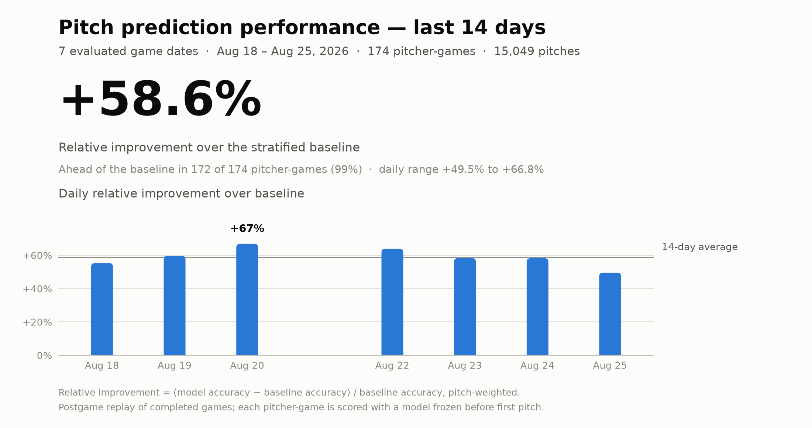

# MLB Pitch Prediction

An end-to-end machine learning system for predicting the next pitch type thrown by MLB starting pitchers using Statcast pitch-by-pitch data.

The project began as a notebook-based case study on Kevin Gausman and has since been expanded into a modular pipeline that dynamically retrieves pitcher data, engineers temporally valid features, trains pitcher-specific models, evaluates completed games, tracks performance over time, and serves results through a Streamlit dashboard.

---

## Results

<!-- RESULTS:START -->

The headline metric is **relative improvement over baseline** — how much further the model gets than a stratified baseline drawing from the same pitcher's historical pitch mix:

```text
relative improvement = (model accuracy − baseline accuracy) / baseline accuracy
```

Results come from automated postgame replay of every eligible MLB starting pitcher, pitch-weighted across all pitcher-games in the window.

<p align="center">
  <picture>
    <source media="(prefers-color-scheme: dark)" srcset="Docs/assets/recent_performance_dark.png">
    
  </picture>
</p>

**Trailing 14 days** · 7 evaluated game dates (August 18 – August 25, 2026) · 174 pitcher-games · 124 pitchers · 15,049 pitches

| Game date | Pitcher-games | Pitches | Relative improvement over baseline |
|---|---:|---:|---:|
| Aug 18 | 22 | 1,774 | +55.3% |
| Aug 19 | 28 | 2,450 | +59.7% |
| Aug 20 | 18 | 1,641 | +66.8% |
| Aug 22 | 29 | 2,632 | +63.9% |
| Aug 23 | 29 | 2,290 | +58.2% |
| Aug 24 | 20 | 1,841 | +58.2% |
| Aug 25 | 28 | 2,421 | +49.5% |
| **14-day total** | **174** | **15,049** | **+58.6%** |

The model finished ahead of the baseline in 172 of 174 pitcher-games (99%).

<!-- RESULTS:END -->

---

## Project Summary

The goal is to predict a pitcher's next pitch using information available before the pitch is thrown.

Pitch selection is modeled as a multiclass classification problem:

```text
Game Context + Pitch History + Batter/Pitcher Information
                         ↓
                Predicted Pitch Type
```

The system is designed around individual pitchers because pitch repertoires and sequencing tendencies vary substantially across MLB pitchers.

The current production model is a pitcher-specific Random Forest trained on historical Statcast data and evaluated chronologically against future games.

---

## Original Research Results

The original Kevin Gausman experiment used approximately 25,000 career pitches and compared several models and feature-engineering stages.

| Dataset | Model | Test Accuracy |
|---|---|---:|
| KG1 | Stratified Baseline | 42.65% |
| KG1 | Random Forest | 57.72% |
| KG2 | Random Forest | 58.52% |
| KG3 | Random Forest | 58.74% |
| KG4 | Random Forest | 58.00% |
| KG4 | Logistic Regression | 55.43% |
| KG4 | Gradient Boosting | 58.11% |
| KG4 | Linear SVM | 55.63% |

Random Forest provided the strongest and most consistent performance and was selected as the primary model for the expanded system.

The production pipeline continues to evaluate performance game-by-game against a stratified baseline and records:

- model accuracy
- baseline accuracy
- correctly predicted pitches
- relative improvement over baseline
- cumulative pitcher and season performance

---

## End-to-End Workflow

```text
MLB Schedule API
        │
        ▼
Identify Starting Pitchers
        │
        ▼
Baseball Savant / Statcast
        │
        ▼
Download Historical Pitch Data
        │
        ▼
Schema Validation
        │
        ▼
Cleaning + Feature Engineering
KG1 → KG2 → KG3 → KG4
        │
        ▼
Pitcher-Specific Random Forest
        │
        ▼
Postgame Replay
        │
        ├── Model Prediction
        ├── Stratified Baseline
        └── Actual Pitch
        │
        ▼
Performance History
        │
        ▼
Streamlit Dashboard
```

### 1. Starter Identification
The MLB schedule API identifies probable or confirmed starting pitchers for a given date.

### 2. Data Retrieval
Career pitch history is retrieved dynamically from Baseball Savant for each pitcher.

### 3. Validation and Cleaning
Incoming Statcast exports are checked against canonical schemas before being cleaned and chronologically ordered.

### 4. Feature Engineering
Raw pitch data is transformed through successive KG feature stages, including previous-pitch information, count context, handedness, pitch sequencing, score context, and recent pitch usage.

### 5. Model Training
A separate Random Forest model is trained for each pitcher using only information available before the prediction date.

### 6. Postgame Evaluation
Completed games are replayed pitch-by-pitch using a frozen pregame model. The target game is excluded from training to prevent temporal leakage.

### 7. Performance Tracking
Pitcher-game results are written to a persistent performance history and displayed through an interactive dashboard.

---

## Architecture and Project Evolution

### Phase 1 — Notebook Prototype

The original project focused on Kevin Gausman and was developed primarily in Jupyter notebooks.

This stage included:

- exploratory data analysis
- data cleaning
- feature engineering experiments
- multiple model comparisons
- feature ablation
- evaluation of Random Forest, Logistic Regression, Gradient Boosting, and SVM models

### Phase 2 — End-to-End Pipeline

The notebook logic was converted into a reusable Python package capable of processing any MLB starting pitcher.

Major improvements include:

- dynamic starting-pitcher discovery
- automated Baseball Savant data retrieval
- strict schema validation
- reusable cleaning and feature-engineering modules
- pitcher-specific model training
- chronological rather than random evaluation
- prevention of target-game leakage
- recency-weighted training data
- repertoire-aware training weights
- stratified baseline comparison
- postgame game replay
- persistent performance history
- automated testing
- Streamlit performance dashboard

The notebooks remain in the repository as the original research and experimentation layer, while production logic now lives in the `pitch_prediction/` package.

---

## Modeling

The production model uses a scikit-learn pipeline with:

- numeric missing-value imputation
- categorical imputation
- one-hot encoding
- Random Forest classification

Current Random Forest configuration:

```python
RandomForestClassifier(
    n_estimators=800,
    max_depth=15,
    min_samples_split=20,
    min_samples_leaf=5,
    max_features="log2",
    bootstrap=True,
    random_state=42,
    n_jobs=-1,
)
```

### Chronological Evaluation

Games are ordered by date and split chronologically:

```text
Older Games → Training
Newest Games → Testing
```

This more closely represents the real prediction problem than randomly splitting individual pitches.

### Recency and Repertoire Weighting

Training observations are weighted so that:

- recent seasons have greater influence than older seasons
- pitches declining from a pitcher's repertoire receive less historical influence
- pitches becoming more prominent receive greater recent influence

Final sample weights combine both components:

```text
sample_weight = recency_weight × repertoire_weight
```

### Baseline

The model is compared against:

```python
DummyClassifier(
    strategy="stratified",
    random_state=42,
)
```

The baseline predicts according to the pitcher's historical pitch distribution without using game context.

---

## Repository Structure

```text
Predicting-Baseball-Pitches/
│
├── config/                    # Canonical Statcast schemas
├── dashboard/                 # Streamlit dashboard
├── Data/                      # Pipeline outputs and performance history
├── Notebooks/                 # Original research notebooks
├── pitch_prediction/          # Core production package
│   ├── clients.py
│   ├── cleaning.py
│   ├── feature_engineering.py
│   ├── model.py
│   ├── performance_history.py
│   ├── pipeline.py
│   ├── postgame_replay.py
│   ├── repertoire.py
│   └── schema.py
├── scripts/                   # Pipeline and experiment entry points
├── tests/                     # Automated tests
├── requirements.txt
└── README.md
```

---

## Requirements

- Python 3.11 recommended
- Internet connection for MLB and Baseball Savant data retrieval

Install dependencies from:

```bash
pip install -r requirements.txt
```

---

## Setup

Clone the repository:

```bash
git clone https://github.com/jonnylee777/Predicting-Baseball-Pitches.git
cd Predicting-Baseball-Pitches
```

Create a virtual environment:

```bash
python3 -m venv .venv
source .venv/bin/activate
```

Install dependencies:

```bash
pip install -r requirements.txt
```

---

## How to Run

### Run the starting-pitcher data pipeline

```bash
python -m scripts.run_daily_pipeline --date 2026-08-20
```

### Evaluate all eligible starters from a completed game date

```bash
python -m scripts.run_daily_postgame_replay --date 2026-08-20
```

If no date is provided, the postgame pipeline defaults to the previous day.

### Evaluate a single pitcher

```bash
python -m scripts.run_postgame_replay \
    --date 2026-08-20 \
    --pitcher-id <MLBAM_ID>
```

### Launch the dashboard

```bash
streamlit run dashboard/app.py
```

### Regenerate the README results section

```bash
python -m scripts.build_readme_results
```

Rebuilds the graphic and the table in **Results** from the current performance
history. Use `--window-days` to change the reporting window.

### Run the test suite

```bash
python -m pytest
```

---

## Performance History

Game-level evaluation results are stored in:

```text
Data/daily_pipeline/performance_history.csv
```

Each row represents one pitcher-game.

The unique key is:

```text
(game_pk, pitcher_id)
```

Re-running an evaluation replaces the existing record rather than creating a duplicate.

Detailed postgame prediction logs are also saved for pitch-level analysis.

---

## Testing and Reliability

The automated test suite covers key production behavior including:

- Statcast schema validation
- data cleaning
- feature engineering
- chronological splitting
- prediction-feature exclusion
- model persistence
- recency weighting
- repertoire weighting
- postgame replay
- target-game leakage prevention

The pipeline is designed to fail explicitly when upstream data schemas change rather than silently training on incompatible data.

---

## Current Status

The project currently supports automated data collection, pitcher-specific model training, historical postgame evaluation, persistent performance tracking, and dashboard reporting.

The current system performs **postgame replay rather than true real-time prediction**. Some existing features depend on information that may not be available before every live pitch.

A future live version will use a dedicated live-compatible feature set and pregame model workflow.

---

## Future Work

Planned improvements include:
- dedicated live-compatible feature set
- model and feature version tracking
- larger historical backtesting
- season-over-season evaluation
- additional tree-based models such as XGBoost and CatBoost
- probability calibration and model confidence analysis